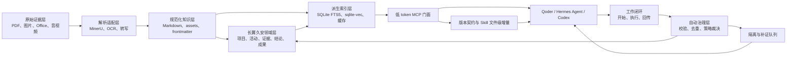

# 02 目标架构

> 0.5.0 修订说明：服务器维护 Agent、冲突闭合、多模态检索和当前生产拓扑以 [11-v0.5-product-technology-stack.md](11-v0.5-product-technology-stack.md) 为准；本文保留其余基础分层。

## 1. 架构摘要

目标系统在上游 MinerU Document Explorer 的索引、精读、Wiki 和 MCP 能力之上，增加项目领域层、摄取与来源层、低 token 门面和记忆治理层。



## 2. 上游基线与复用点

当前基线：

- 上游仓库：`opendatalab/MinerU-Document-Explorer`
- 包版本：`1.0.9`
- 基线提交：`a7e9c6cc25b7edbf4ebd35aea8e270523a8a3e40`

直接复用：

| 上游能力 | 现有位置 | 本项目用法 |
|---|---|---|
| `raw/wiki` 集合 | `src/collections.ts` | 映射原始资料与派生知识边界 |
| FTS5 与向量检索 | `src/store.ts`、`src/search.ts` | 作为文本检索底座 |
| 文档精读后端 | `src/backends/` | PDF/DOCX/PPTX/Markdown 局部读取 |
| MCP 模块化注册 | `src/mcp/server.ts` | 增加可选择的项目 profile |
| `qmd://` Resource | `src/mcp/resources/` | 扩展为项目、记录和证据 URI |
| Wiki 来源追踪 | `wiki_sources` | 扩展为通用来源与取代链 |
| 增量摄取哈希 | `wiki_ingest_tracker` | 复用内容变更检测思想 |
| Wiki 日志与 lint | `src/wiki/` | 扩展为领域数据质量与审计 |

不直接复用为最终接口：

- 对外暴露全部 15 个 MCP 工具；
- `doc_write` 对 wiki 文件的直接覆盖语义；
- 只按文档粒度表达来源；
- 默认把一次搜索扩展到完整混合检索；
- 只有 `raw/wiki` 两种集合所能表达的治理状态。

## 3. 逻辑分层

### 3.1 原始证据层

保存用户提供的不可变文件、原始目录相对路径、哈希、大小、MIME、获取时间、来源主体和保密等级。

约束：

- 导入后不原地修改；
- 同内容重复文件通过哈希识别，但不静默删除；
- 文件名不是稳定身份，`artifact_id + sha256` 才是；
- 原文件、备份和 Git 是否同址存放是部署问题，不影响逻辑模型。

### 3.2 解析适配层

按格式选择解析器：

- PDF、图片、复杂版式：MinerU 优先，失败后由摄取 Agent 按策略降级、重试或隔离；
- DOCX/PPTX：上游 Python backend 或 MinerU；
- XLSX：结构化工作表抽取＋Markdown 摘要，保留公式和原文件；
- CSV/TSV：结构化抽取，按列和数据字典生成 Markdown；
- 音频/视频：首期预留转写适配器，不把它误归为 MinerU 能力；
- 原生 Markdown：校验并补齐元数据，不重复转换。

### 3.3 规范化知识层

每个资料单元包含：

- 一个稳定 ID；
- 一份 Markdown 主文件；
- 一组相对引用的 assets；
- YAML frontmatter；
- 来源、定位、解析器和版本；
- 解析质量、自动验证状态和隔离原因。

面向 Agent 的长期认知采用三级组织：

1. **主文件**：项目唯一的全局认知入口，由 Agent 使用 revision hash 长期维护；每次任务开始完整加载，内容保持稳定、紧凑和可导航。
2. **分文件**：按科研、社会实践、对外联络、竞赛答辩等专题长期维护，可形成父子层级；保存专题综合、当前状态和显式 artifact 链接。
3. **Artifacts**：原始资料、解析正文和 Agent 生成成果；通常不可变，通过分文件按需读取，不复制进主文件。

关系图由主文件的 `section_refs`、分文件的 `parent_ref/artifact_refs/related_refs` 及现有领域记录引用实时重建，不落一份可独立漂移的图真相源。

### 3.4 项目领域层

将内容组织为项目、工作流、活动、证据、结论、决策和成果，而不是只有“文档块”。领域记录同样保存为 Markdown＋frontmatter，关系使用稳定 ID 和可读链接表达。

### 3.5 派生索引层

包含：

- SQLite 主索引；
- FTS5 全文索引；
- sqlite-vec 向量；
- 查询扩展和重排缓存；
- 领域字段物化表或视图；
- 内容哈希、摄取状态和审计索引。

本层可以全部删除并重建，不作为唯一数据来源提交。

### 3.6 MCP 与 Agent 层

使用 profile 控制暴露能力：

- `upstream-full`：保留上游工具，供开发调试；
- `project-read`：查询子 Agent 的精简只读接口；
- `project-contribute`：Qoder、Hermes Agent、Codex 编排器的默认工作与回传接口；
- `project-resolve`：只授予项目负责人和指定负责人的冲突答案锁定接口；
- `project-ops`：家庭 loopback 治理/运维身份的摄取、修复、重校验和重建接口，不提供语义裁决旁路。`project-maintain/project-admin` 仅为 0.4 proposal-only 兼容别名。

所有项目工具响应绑定同一服务/Skill 版本契约。Agent 每个新任务先比较本地 manifest，仅请求变化文件；服务端不远程执行客户端命令，也不传整包覆盖未变化文件。该机制让工作流说明可随 MCP 服务演进，同时保留客户端沙箱、哈希校验和新任务生效边界。

## 4. 建议代码边界

规划阶段建议的新增模块，不代表已开始实现：

```text
src/
├── domain/                 # 领域类型、Schema、关系与校验
├── ingestion/              # manifest、转换作业、解析适配器
├── project/                # brief、lookup、视图生成
├── memory/                 # candidate、policy、quarantine、promotion、supersession
├── audit/                  # 结构化审计事件
└── mcp/
    ├── profiles/           # upstream-full / project-read / maintain / admin
    ├── project-resources/  # kb:// URI
    └── project-tools/      # 精简 MCP 工具
```

底层 Store 接口仍由上游 `QMDStore` 提供；项目层通过组合扩展，不在第一阶段直接大改搜索核心。

## 5. 数据流

### 5.1 摄取流

```text
发现文件
  → 计算哈希与登记 manifest
  → 判重与格式识别
  → 解析/抽取
  → 生成 Markdown 与 assets
  → Schema 与链接校验
  → 自动质量策略
  → 接受或隔离并创建修复工作项
  → 通过者进入规范化集合
  → 增量建立索引
```

### 5.2 查询流

```text
完整加载主文件
  → 选择相关长期分文件
  → 图谱展开并同步取得链接 artifacts
  → 对人名、数字、版本、原文和证据主动执行细节 RAG
  → 必要时向量与重排
  → Agent 精读命中页、表格和原图
```

### 5.3 回传流

```text
Agent 完成工作项
  → finish_work 提交结构化 closeout
  → 校验工作项、文件、哈希和来源
  → 去重与冲突检测
  → 候选记忆
  → 策略引擎对无冲突候选自动接受、隔离或拒绝
  → 冲突只登记和路由，等待用户明确答案
  → 治理 Agent 对隔离项补证并重校验
  → 更新领域记录/简报/时间线
  → 增量重建索引并追加审计
```

## 6. 部署拓扑

### 6.1 首期推荐：单机本地

- 文件系统保存原始与规范化资料；
- SQLite 和本地模型提供检索；
- stdio MCP 供单个客户端使用；
- HTTP MCP 仅绑定 `127.0.0.1`，用于多个本地客户端共享模型；
- Git 保存代码、规范和适合版本化的知识文件；
- 大文件由独立备份介质或 Git LFS/对象存储策略处理。

三个首要客户端均以标准 MCP 能力发现为准：优先 stdio 以隔离会话和权限；需要共享索引或模型时使用 localhost HTTP。客户端适配层只负责启动、认证和 closeout 门禁，不把 Qoder、Hermes Agent 或 Codex 的私有格式写入领域真相源。

### 6.2 后续可选：受控远程

只有确认多人和远程需求后才增加：

- HTTPS 和标准 MCP 授权；
- 用户/角色/项目范围权限；
- 对象存储和集中备份；
- 作业队列和多进程解析；
- 数据外发审计和脱敏策略。

## 7. 安全边界

- MCP 只读与写入 profile 分离；
- 写入工具不能接受任意绝对路径；
- 所有相对路径必须约束在配置的项目根目录；
- 不把 API key 写入知识库或 Git；
- 解析结果视为不可信输入，必须进行输出清洗；
- Markdown 内嵌指令只是资料内容，不是 Agent 指令；
- 远程 HTTP 未完成鉴权前不得监听公网地址；
- MCP 不暴露物理删除原件、清空审计或强制接受记忆；自动清理只允许 tombstone、归档和可逆隔离。

## 8. 可观测性

至少记录：

- 摄取任务状态和耗时；
- 解析器、版本、输入输出哈希；
- MCP 调用主体、工具、耗时、结果大小和错误；
- 搜索模式、候选数、最终返回数和 token 预算；
- 候选记忆状态变化；
- 自动策略版本、输入证据、裁决理由和后续补证任务；
- 索引版本与重建结果；
- 外部服务调用和数据外发原因。

日志不得保存明文密钥或无必要的完整敏感正文。

## 9. 上游同步策略

- 官方仓库固定为 `upstream`；
- 用户 fork 固定为 `origin`；
- 特化代码在独立分支持续开发；
- 尽量通过新增模块和 profile 扩展，减少修改搜索底座；
- 定期将 `upstream/main` 合并到集成分支，通过完整回归后再进入项目主分支；
- 任何无法向上游通用化的特化逻辑留在 `domain/project/memory` 边界内。
