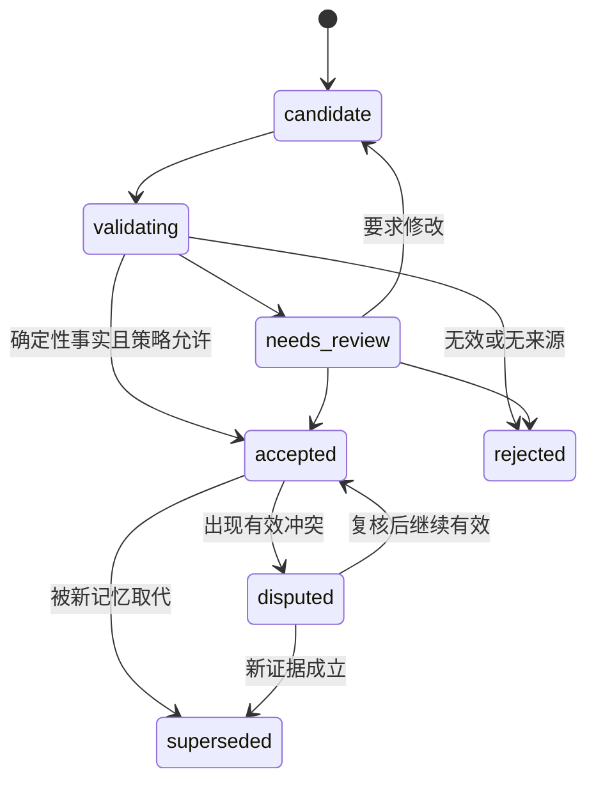

# 06 记忆生命周期

## 1. 为什么需要候选记忆

Agent 产生的总结可能包含误读、过时信息、无证据推断和过度概括。如果任务一完成就直接写入正式知识，错误会在后续检索中不断被放大。

因此，本项目将“工作结果”和“正式记忆”分开：

- 工作结果描述本次任务实际完成了什么；
- 候选记忆描述可能值得长期复用的内容；
- 正式记忆是经过校验和审批、允许影响未来回答的内容。

## 2. 生命周期



状态含义：

- `candidate`：刚提交，尚未校验；
- `validating`：结构、来源、判重和冲突检查中；
- `needs_review`：需要负责人判断；
- `accepted`：可用于默认检索和项目简报；
- `rejected`：保留审计，不进入默认检索；
- `disputed`：存在未解决冲突，回答时必须披露；
- `superseded`：历史有效但已被新记录取代。

## 3. 候选记忆结构

```yaml
id: memory-candidate:cyj:01JZ...
project_id: project:cyj:main
kind: lesson
statement: "复杂扫描 PDF 应优先使用 MinerU 本地 VLM，而非 PyMuPDF。"
scope: ingestion.pdf.scanned
source_work_id: work:cyj:01JZ...
evidence_refs:
  - artifact:cyj:parse-benchmark-001
confidence: 0.88
submitted_by: agent:codex
submitted_at: 2026-07-21T00:00:00Z
status: candidate
valid_from: 2026-07-21
review_due_at: 2026-08-21
```

## 4. 允许保存的内容

| 类型 | 示例 | 默认审批 |
|---|---|---|
| `fact` | 已验证项目名称、负责人、成果状态 | 有权威结构化来源时可自动 |
| `decision` | 已接受的架构或项目决定 | 必须有决策记录；通常人工 |
| `procedure` | 已实际执行并验证的流程 | 有成功运行证据时可策略审批 |
| `lesson` | 失败原因、有效经验、边界条件 | 人工或严格规则 |
| `constraint` | 保密、时间、技术和资源限制 | 权威来源可自动，否则人工 |
| `preference` | 负责人确认的写作或工作偏好 | 必须人工确认 |
| `open_question` | 尚未解决但值得持续追踪的问题 | 可自动进入问题队列 |

不进入正式记忆：

- 完整聊天记录；
- 未引用来源的泛化总结；
- 一次性临时路径、进程号和短期令牌；
- 密钥、密码、认证 Cookie；
- 对个人的无证据评价；
- 与项目无关的推断；
- 已被正式记录完整覆盖的重复内容。

## 5. 校验流程

### 5.1 Schema 校验

检查类型、必填字段、状态、ID、时间和保密等级。

### 5.2 来源校验

- `work_id` 存在并处于可关闭状态；
- evidence/artifact 引用存在；
- artifact 哈希与当前文件一致；
- 定位器仍能在当前源版本解析；
- 提交主体具有候选写入权限。

### 5.3 判重

依次使用：

1. 幂等键 `work_id + result_hash`；
2. 规范化 statement 哈希；
3. 同 scope、kind 的精确匹配；
4. 语义近似只作为人工提示，不自动合并。

### 5.4 冲突

新候选与已接受记忆发生否定、数值不一致、时间重叠或状态矛盾时：

- 不静默覆盖；
- 创建 conflict 记录；
- 标记双方来源和有效时间；
- 必要时将旧记忆置为 `disputed`；
- 由审批人决定保持并存、限定范围或 supersede。

## 6. 自动接受边界

首期默认只有下列确定性更新可以自动接受：

- 文件已创建且哈希验证通过；
- 自动测试命令及对应日志证明通过；
- 已存在的结构化记录发生允许的状态迁移；
- 工作项完成时间、运行耗时等系统事件；
- 权威表格中无歧义字段的同步。

以下内容必须人工确认：

- 研究结论和因果解释；
- 社会实践中的人物或组织判断；
- 长期方法、经验和偏好；
- 对外发布表述；
- 任何降低保密级别的变更；
- 对旧决定或正式事实的取代。

## 7. 工作项 closeout

每个 closeout 必须区分：

### 已完成

- 实际产出；
- 文件与哈希；
- 验收命令和结果；
- 与目标的差异。

### 新知识候选

- 事实、决定、方法和经验；
- 每条内容的适用范围；
- 证据和置信度。

### 未解决

- 阻塞、风险、失败和后续工作；
- 是否影响本次完成判断。

工作项可以是 `partial` 或 `failed`，失败同样可以提交有效 lesson，但不能被包装成已完成。

## 8. 阶段/项目收尾

阶段收尾在工作项 closeout 之上生成：

- 最终成果清单；
- 目标—证据—结论矩阵；
- 被接受和被推翻的假设；
- 关键决策演进；
- 可复用方法、模板和失败模式；
- 未解决问题与移交事项；
- 资料完整性、索引和备份状态。

阶段复盘本身也是派生知识，必须保留其输入记录和生成版本。

## 9. 检索规则

- 默认只检索 `accepted`；
- 用户问“争议/历史/为什么改变”时包含 `disputed` 和 `superseded`；
- `candidate` 只在维护和审批场景可见；
- 返回 superseded 内容时同时给出替代记录；
- 带有效时间的查询按 `as_of` 过滤；
- 正式记忆不能压过更高等级的原始证据。

## 10. 删除与保留

- 普通操作不物理删除 accepted/rejected/superseded 历史；
- 涉及个人数据删除权时执行受审计的擦除流程，并保留不含原文的最小合规事件；
- 候选记忆按保留策略归档，但不得因自动清理丢失待审批重要项；
- 审计日志和知识正文分开，避免删除知识时破坏系统完整性。
