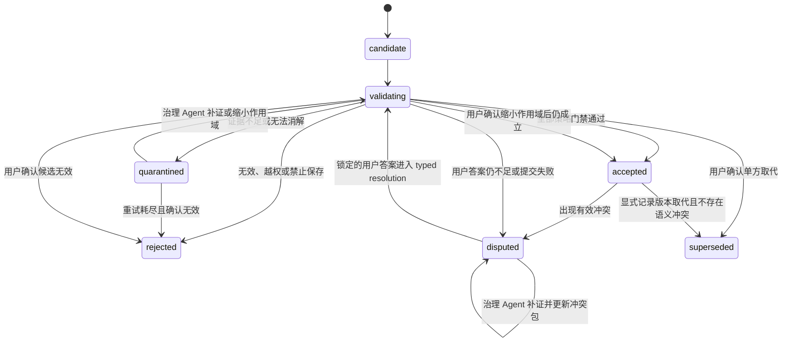

# 06 记忆生命周期

> 0.5.0 修订说明：自动晋升仅适用于无冲突候选；事实冲突不得由 Agent、来源排序或新文件版本自动关闭。完整协议见 [ADR-0005](adr/0005-server-maintenance-agent-harness.md)。

## 1. 候选层仍然必要

Agent 全托管不等于 Agent 可以直接改写正式记忆。Agent 产生的总结可能包含误读、过时信息、无证据推断和过度概括；若任务一结束就直接写入正式知识，错误会在后续检索中持续放大。

因此系统区分：

- 工作结果：本次任务实际完成了什么；
- 候选记忆：可能值得跨任务复用的内容；
- 正式记忆：通过自动证据策略、允许影响未来回答的内容；
- 隔离记忆：暂时无法证明、存在冲突或需要机器补证的内容。

正常路径不设置人工审批。安全性由服务端策略、隔离、审计和失败关闭保证。

## 2. 生命周期



状态含义：

- `candidate`：刚提交，尚未校验；
- `validating`：结构、来源、安全、判重、冲突和策略检查中；
- `accepted`：可用于默认检索和项目简报；
- `quarantined`：不进入默认检索，等待 Agent 补证、重试或限定范围；
- `rejected`：保留最小审计，不进入默认检索；
- `disputed`：曾被接受但出现有效冲突，回答时必须披露；
- `superseded`：历史有效但已被新记录取代。

memory 状态机不等同于 conflict 状态机。ConflictRecord 单独使用：

```text
open -> resolution_pending -> resolved
  ^            |
  |------------|  用户答案不足、revision 失效或事务失败
```

`resolution_pending` 表示已有可认证用户答案，等待 typed resolution 和原义补丁完成原子提交。

## 3. 候选记忆结构

```yaml
id: memory:cyj:01JZ...
project_id: project:cyj:main
kind: lesson
statement: "复杂扫描 PDF 在当前基准中使用 MinerU 本地 VLM 的定位完整率更高。"
scope: ingestion.pdf.scanned
source_work_id: work:cyj:01JZ...
evidence_refs:
  - artifact:cyj:parse-benchmark-001
confidence: 0.88
submitted_by: agent:codex
submitted_at: 2026-07-21T00:00:00Z
status: candidate
valid_from: 2026-07-21
validation_due_at: 2026-07-21T00:05:00Z
policy_version: memory-policy-0.2.0
remediation_attempts: 0
```

每次状态变化生成不可变 validation event，至少保存输入哈希、证据、策略版本、裁决、理由码、Actor 和 trace ID。

## 4. 内容类型与自动策略

| 类型 | 示例 | 初始自动晋升条件 |
|---|---|---|
| `fact` | 项目名称、成果状态、文件哈希 | 权威结构化来源或可直接回读的精确证据 |
| `decision` | 架构或项目决定 | 可认证用户指令、Accepted ADR 或等价决策记录 |
| `procedure` | 已执行并验证的流程 | 命令、版本、输入输出和成功验证可复现 |
| `lesson` | 失败原因、有效经验、边界条件 | 作用域明确，且有独立证据或可重复实验支持 |
| `constraint` | 保密、时间、技术和资源限制 | 权威策略文件或可认证用户指令 |
| `preference` | 写作或工作偏好 | 可认证用户指令；从行为推断的偏好默认隔离 |
| `open_question` | 尚未解决但值得追踪的问题 | 可自动进入问题队列，但不得渲染为事实 |

永不进入正式记忆：

- 完整聊天记录；
- 未引用来源的泛化总结；
- 一次性临时路径、进程号和短期令牌；
- 密钥、密码、认证 Cookie；
- 对个人的无证据评价；
- 与项目无关的推断；
- 已被正式记录完整覆盖的重复内容。

## 5. 自动校验门禁

### 5.1 Schema 与状态

检查类型、必填字段、ID、时间、保密等级、允许状态迁移和幂等键。任一硬错误直接拒绝或隔离，不做“尽量写入”。

### 5.2 来源与完整性

- `work_id` 存在并处于可 closeout 状态；
- evidence/artifact 引用存在；
- artifact 哈希与当前文件一致；
- 定位器仍能在当前源版本解析；
- 提交 Agent 具有相应 capability；
- 来源没有被标记为 stale、rejected 或权限不可见。

来源优先级默认遵循：可认证用户指令或策略文件 > 不可变原始证据 > 确定性系统事件 > 可复现实验/测试 > 有证据派生主张 > 单次 Agent 总结。

### 5.3 安全

检测密钥模式、个人敏感信息、越权引用、提示注入内容和不允许的数据外发痕迹。保密级别只能保持或提高，不能因摘要自动降低。

### 5.4 判重

依次使用：

1. `work_id + result_hash`；
2. 规范化 statement 哈希；
3. 同 scope、kind 的精确匹配；
4. 语义近似。

语义近似只生成关系或合并候选；除非字段、来源和有效期均满足确定性规则，否则不自动覆盖已有 accepted 记忆。

### 5.5 冲突

新候选与 accepted 记忆发生否定、数值不一致、时间重叠或状态矛盾时：

1. 创建 conflict 记录并标明双方来源和有效时间；
2. 旧记录进入 `disputed`，新记录进入 `quarantined` 或作为冲突变体保存；
3. 来源权威性、时间、作用域和证据强度只用于解释冲突和生成用户问题，不用于自动选边；
4. 自动创建治理工作项，补充证据、限定作用域或复现实验；既有冲突的新证据必须绑定目标 claim variant，并在验证同项目、指纹与密级后经 `ConflictService.append_conflict_evidence` 单调追加 evidence/source 与 `last_seen_revision`，不能改写 claim 原义、状态或 resolution；resolved 冲突遇到反证时必须新建引用旧 resolution 的 open 冲突；
5. 相关检索必须附加冲突，本地 Agent 谨慎回答并在必要时询问用户；
6. 只有可认证的用户明确答案可触发 `lock_user_resolution`，原子保存 resolution record、使 ConflictRecord 进入 `resolution_pending` 并入队；只有 `apply_typed_resolution` 将 typed outcome 与文档/拓扑补丁同事务提交后才标记已解决，`remain_open` 则退回 open；
7. 原说法、证据、冲突记录和解决历史永久保留。

用户答案的 typed resolution 不强迫选边，可以是：一方 superseded；双方按时间、地点、对象或 scope 缩小后同时 accepted；双方均无效并形成新的 accepted 结论；某候选 rejected；或答案仍不足、继续 disputed/open。通用文档/拓扑补丁不得修改 ConflictRecord、冲突状态、`conflict_refs` 或冲突派生摘要。

## 6. 策略裁决

每个 memory kind 有独立、版本化策略。初始规则：

- 文件哈希、测试结果、合法状态迁移和作业事件可在确定性验证后接受；
- 研究结论和因果解释需要至少一个精确原始证据，并有独立证据或可重复验证；
- 人物或组织判断必须限定为事实/观察，推断默认隔离；
- 长期方法必须带适用范围、运行版本和成功/失败证据；
- 用户偏好只能从可认证用户指令自动接受；
- 降低保密等级、物理删除原件和清空审计永不由记忆策略执行；
- accepted 取代必须保留旧记录、来源和有效时间。

策略引擎故障、超时或版本缺失时一律 fail closed：工作结果可以落盘，但候选不得进入 accepted。

## 7. 工作项 closeout

每个 closeout 必须区分：

### 已完成

- 实际产出；
- 文件与哈希；
- 验收命令和结果；
- 与目标的差异。

### 新知识候选

- 事实、决定、方法和经验；
- 每条内容的适用范围；
- 证据和置信度。

### 未解决

- 阻塞、风险、失败和后续工作；
- 是否影响本次完成判断。

工作项可以是 `partial` 或 `failed`。失败同样可以提交有效 lesson，但不能被包装成已完成。

## 8. 治理 Agent 循环

治理 Agent 以租约避免多客户端重复处理，并持续执行：

1. 领取 `candidate/quarantined/disputed` 项；
2. 运行全部校验门禁；
3. 保存 validation event 和 policy trace；
4. 对可修复项创建补证、重新解析或复现实验工作项；
5. 在重试预算内指数退避；
6. 超过预算后保持隔离并生成诊断摘要，不伪造成功；
7. 刷新受影响的简报、时间线和索引；
8. 验证 closeout、索引和审计均已提交后才结束治理任务。

Qoder、Hermes Agent 和 Codex 使用同一状态机；客户端重试不得改变最终裁决或产生重复记录。

## 9. 阶段与项目收尾

阶段收尾在工作项 closeout 之上自动生成：

- 最终成果清单；
- 目标—证据—结论矩阵；
- 被接受、隔离和推翻的假设；
- 关键决策演进；
- 可复用方法、模板和失败模式；
- 未解决问题与移交事项；
- 资料完整性、索引和备份状态。

阶段复盘本身也是派生知识，必须保留输入记录、生成版本和 validation event。

## 10. 检索规则

- 默认只检索 `accepted`；
- 查询争议、历史或变化原因时包含 `disputed/superseded`；
- `candidate/quarantined` 只对治理 Agent 可见；
- 返回 superseded 内容时同时给出替代记录；
- 带有效时间的查询按 `as_of` 过滤；
- 正式记忆不能压过更高等级的原始证据。

## 11. 删除与保留

- 普通操作不物理删除 accepted/rejected/quarantined/superseded 历史；
- 涉及个人数据删除权时执行预先配置的受审计擦除策略，并保留不含原文的最小合规事件；
- 隔离项按策略归档，但不得在诊断或补证任务未落盘时静默丢失；
- 审计日志和知识正文分开，避免知识生命周期破坏系统完整性。
