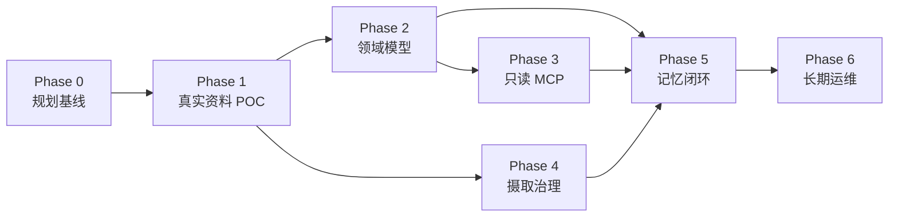

# 07 实施路线

## 总体策略

项目采用“文书冻结 → 小样本验证 → 领域层 → 只读 MCP → 受控写回 → 运维完善”的顺序。每阶段有独立退出条件，未通过时不以继续堆功能代替修复。

## Phase 0：Fork 与规划基线

### 目标

建立可持续 fork、明确上游复用边界和可执行规格。

### 交付物

- GitHub fork、`origin/upstream` remote；
- 独立改造分支；
- 本目录全部规划文书；
- 领域模型和 MCP 机器可读草案；
- 初始 ADR；
- 上游构建/测试基线记录。

### 退出条件

- 文书链接和 YAML 可解析；
- 未决产品问题有明确默认值和影响；
- 上游未改代码时测试基线可复现；
- fork 分支已推送且不污染上游 main。

## Phase 1：真实资料 POC

### 目标

用真实混合材料验证 MinerU、上游精读和中文检索是否足以作为底座。

### 样本建议

- 5 份文本型 PDF；
- 5 份扫描/复杂版式 PDF；
- 3 份 DOCX；
- 3 份 PPTX；
- 2 份 XLSX/CSV；
- 5～10 张项目图片；
- 至少一份包含敏感字段的测试材料，用于权限验证。

### 工作

- 建立只读 inventory 和 manifest；
- 配置本地基础解析路径；
- 对需要 MinerU 的样本执行受控转换；
- 建立解析质量抽检表；
- 建立 30～50 个标准问题和证据答案；
- 对 BM25、向量、混合检索和局部读取进行测量。

### 退出条件

- 原始样本 100% 登记和哈希；
- 关键来源定位可回到页码/幻灯片/工作表；
- 已明确需要人工复核的格式和失败模式；
- 检索指标达到 Phase 1 门槛或有可实施修复方案；
- 确认默认中文 embedding/reranker 方案。

## Phase 2：领域记录与结构化视图

### 目标

实现项目总体信息的单一真相源和可维护视图。

### 工作

- 实现共同字段、ID 和 Schema validator；
- 首批 record 类型：project、workstream、work_item、activity、artifact、evidence、claim、decision、deliverable、risk；
- 解析 frontmatter 并物化结构化字段；
- 生成项目简报、时间线、人员组织索引、成果和风险表；
- 扩展 lint：broken ID、缺失证据、非法状态迁移、失效来源；
- 建立 Schema 迁移机制。

### 退出条件

- 示例记录全部通过 Schema；
- 视图可从记录重建且无双向手工同步；
- 非法 claim/decision/memory 状态被拦截；
- 文件移动不破坏稳定 ID 和关系。

## Phase 3：低 token 只读 MCP

### 目标

让 Agent 用最少上下文完成项目问答和资料定位。

### 工作

- 实现 MCP profile 选择；
- 实现 `kb_brief/lookup/search/outline/read`；
- 增加 `kb://` Resource；
- 实现字段过滤、review/confidentiality 过滤；
- 实现预算、分页、截断和 resource link；
- 保留 `upstream-full` 兼容 profile；
- 编写 Agent Skill 和调用示例。

### 退出条件

- 普通 Agent 不可见维护/管理工具；
- 标准问题引用正确；
- 默认上下文达到 token 门槛；
- 超长文档通过目录和局部读取完成问答；
- 不泄漏绝对路径和越权记录。

## Phase 4：摄取作业与来源治理

### 目标

将手工 POC 固化为幂等、增量、可恢复的资料维护流程。

### 工作

- manifest 与 job 状态机；
- 解析器适配器和参数指纹；
- 规范化目录及 parse report；
- 图片/表格 sidecar；
- 失败、重试、人工复核队列；
- 源变化后的 stale 传播；
- 数据外发审计；
- 增量索引触发。

### 退出条件

- 重复导入不会重复解析和重复记录；
- 失败可重试且原件不受影响；
- 解析器升级可控迁移；
- 删除派生产物后可重建；
- 敏感样本不会调用未获授权的云服务。

## Phase 5：任务闭环与记忆晋升

### 目标

让 Agent 的项目工作形成受控、可核验的长期积累。

### 工作

- `kb_start_work/finish_work`；
- work closeout Schema 和幂等键；
- memory candidate 状态机；
- 来源、判重和冲突检查；
- `kb_review_memory`；
- accepted/disputed/superseded 检索规则；
- 完成门禁与 Agent Skill；
- 审计和项目简报增量刷新。

### 退出条件

- 相同 closeout 重试不重复写入；
- 无证据推断不会自动进入正式记忆；
- 冲突不会静默覆盖；
- 失败任务可以诚实记录 lesson；
- 记忆审批和取代历史可完整审计。

## Phase 6：运维、备份与可选协作界面

### 目标

把系统从“可用”提升为可长期维护。

### 工作

- 备份、恢复和全量重建演练；
- 上游同步和迁移测试；
- 索引、作业和 MCP 健康检查；
- 结构化表格维护界面；
- 若确认多人需求，再增加远程鉴权与角色权限；
- 若真实评测证明必要，再接多模态 RAG 或时态图谱。

### 退出条件

- 在空索引环境完成恢复；
- 上游升级通过回归；
- 维护者能从 UI/CLI 处理失败和待审批项；
- 运维文档由非开发者按步骤执行成功。

## 依赖关系

## 实施优先级

必须优先：来源、结构化记录、只读检索、引用、候选记忆。

可以延后：复杂前端、多人协作、图数据库、视觉大模型深度问答、云部署。

## 风险与缓解

| 风险 | 影响 | 缓解 |
|---|---|---|
| 上游项目较新 | API/结构可能变化 | 固定基线、组合扩展、上游回归 |
| 中文语义模型效果不足 | 召回错误 | 真实 gold set、可替换模型、BM25 保底 |
| MinerU 转换失真 | 错误证据 | 原件保留、页码定位、质量队列 |
| Agent 记忆污染 | 错误长期放大 | 候选、来源、审批、冲突状态 |
| 文书与代码漂移 | 实现失控 | 机器可读规格、CI 校验、ADR |
| 大文件使 Git 膨胀 | 运维困难 | 代码/元数据与大对象分离、LFS/备份策略 |
| 过早引入图谱 | 成本和复杂度上升 | 先用类型记录与关系表，评测后决策 |
