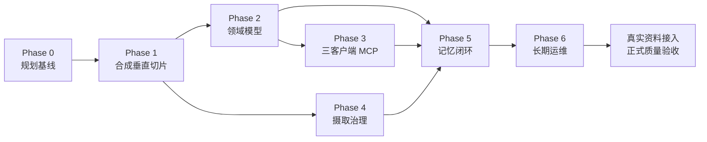

# 07 实施路线

> 0.5.0 修订说明：事实冲突不再属于自动裁决范围，只能登记、路由、披露并由用户明确回答；服务器维护 Worker 与多模态检索的实施顺序以 [11-v0.5-product-technology-stack.md](11-v0.5-product-technology-stack.md) 为准。

## 总体策略

项目采用“文书冻结 → 合成垂直切片 → 领域层 → 三客户端 MCP → Agent 自动写回 → 运维完善 → 真实资料验收”的顺序。每阶段有独立退出条件，未通过时不以继续堆功能代替修复。

## Phase 0：Fork 与规划基线

### 目标

建立可持续 fork、明确上游复用边界和可执行规格。

### 交付物

- GitHub fork、`origin/upstream` remote；
- 独立改造分支；
- 本目录全部规划文书；
- 领域模型和 MCP 机器可读草案；
- 初始 ADR；
- 上游构建/测试基线记录。

### 退出条件

- 文书链接和 YAML 可解析；
- 未决产品问题有明确默认值和影响；
- 上游未改代码时测试基线可复现；
- fork 分支已推送且不污染上游 main。

## Phase 1：合成语料垂直切片

### 目标

在历史资料暂不提供的条件下，用合成、脱敏、可公开提交的 fixture 打通领域记录、摄取契约、检索、MCP、closeout 和自动记忆治理。该阶段验证工程契约，不冒充真实项目语料效果。

### Fixture 建议

- 2 份文本型 PDF 和 1 份扫描 PDF；
- 1 份 DOCX、1 份 PPTX、1 份 XLSX/CSV；
- 3～5 张合成项目图片；
- 一组科研实验、访谈、活动、决策、成果和风险的关联记录；
- 至少一份合成 restricted 材料、一个冲突事实和一个提示注入样本。

### 工作

- 建立 fixture inventory、manifest 和期望来源定位；
- 实现最小 project/work/artifact/evidence/memory Schema validator；
- 实现 `kb_brief`、`kb_lookup` 和 `kb_finish_work` 的最小贯通路径；
- 建立 20～30 个确定性标准问题和证据答案；
- 验证候选自动晋升、隔离、冲突、补证和幂等重试；
- 为 Qoder、Hermes Agent 和 Codex 建立连接配置与 smoke test；
- 不扫描用户磁盘、不下载历史资料、不提交真实敏感内容。

### 退出条件

- fixture 100% 登记、哈希并可从源重建；
- 三客户端至少各完成一次 start → retrieve → finish → memory policy 闭环；
- 无证据候选、冲突和提示注入样本均被自动隔离；
- 不需要人工修改文件或数据库才能完成垂直切片；
- 未验证真实语料、真实 MinerU 质量和中文语义模型效果的边界被明确保留。

## Phase 2：领域记录与结构化视图

### 目标

实现项目总体信息的单一真相源和可维护视图。

### 工作

- 实现共同字段、ID 和 Schema validator；
- 首批 record 类型：project、workstream、work_item、activity、artifact、evidence、claim、decision、deliverable、risk；
- 解析 frontmatter 并物化结构化字段；
- 生成项目简报、时间线、人员组织索引、成果和风险表；
- 扩展 lint：broken ID、缺失证据、非法状态迁移、失效来源；
- 建立 Schema 迁移机制。

### 退出条件

- 示例记录全部通过 Schema；
- 视图可从记录重建且无双向手工同步；
- 非法 claim/decision/memory 状态被拦截；
- 文件移动不破坏稳定 ID 和关系。

## Phase 3：低 token MCP 与三客户端互操作

### 目标

让 Qoder、Hermes Agent 和 Codex 用最少上下文完成项目问答、资料定位、任务回传和强制 closeout。

### 工作

- 实现 MCP profile 选择；
- 实现 `kb_brief/lookup/search/outline/read`；
- 实现 `kb_start_work/finish_work` 的稳定结构化契约；
- 增加 `kb://` Resource；
- 实现字段过滤、validation/confidentiality 过滤；
- 实现预算、分页、截断和 resource link；
- 保留 `upstream-full` 兼容 profile；
- 编写三个客户端的 Agent Skill、连接配置和调用示例；
- 验证 stdio 默认路径与 localhost HTTP 共享路径；
- 实现租约、幂等键和 closeout 完成门禁。

### 退出条件

- 查询 Agent 不可见贡献/管理工具，团队编排器默认使用 `project-contribute`；resolver 与 ops 使用独立 principal；
- Qoder、Hermes Agent、Codex 的契约 smoke test 全部通过；
- 标准问题引用正确；
- 默认上下文达到 token 门槛；
- 超长文档通过目录和局部读取完成问答；
- 不泄漏绝对路径和越权记录。

## Phase 4：摄取作业与来源治理

### 目标

将合成 POC 固化为幂等、增量、可恢复的资料维护流程，并为未来真实资料保留稳定入口。

### 工作

- manifest 与 job 状态机；
- 解析器适配器和参数指纹；
- 规范化目录及 parse report；
- 图片/表格 sidecar；
- 失败、重试和 Agent 隔离修复队列；
- 源变化后的 stale 传播；
- 数据外发审计；
- 增量索引触发。

### 退出条件

- 重复导入不会重复解析和重复记录；
- 失败可重试且原件不受影响；
- 解析器升级可控迁移；
- 删除派生产物后可重建；
- 敏感样本不会调用未获授权的云服务。

## Phase 5：任务闭环与记忆晋升

### 目标

让 Agent 的项目工作形成受控、可核验的长期积累。

### 工作

- `kb_start_work/finish_work` 与 closeout 门禁；
- work closeout Schema 和幂等键；
- memory candidate 状态机；
- 来源、判重和冲突检查；
- 策略引擎、validation event 与 `kb_reconcile_memory`；
- accepted/disputed/superseded 检索规则；
- 完成门禁与 Agent Skill；
- 审计和项目简报增量刷新。

### 退出条件

- 相同 closeout 重试不重复写入；
- 无证据推断不会自动进入正式记忆；
- 冲突不会静默覆盖；
- 失败任务可以诚实记录 lesson；
- 无冲突候选的自动裁决、隔离、补证、冲突路由和经用户确认的取代历史可完整审计；
- 系统在无人工审批下持续清空可处理队列，无法处理项诚实保持隔离。

## Phase 6：运维、备份与可选协作界面

### 目标

把系统从“可用”提升为可长期维护。

### 工作

- 备份、恢复和全量重建演练；
- 上游同步和迁移测试；
- 索引、作业和 MCP 健康检查；
- Agent 运维 runbook、定时健康检查和自动恢复；
- 可选只读观察界面；
- 若确认多人需求，再增加远程鉴权与角色权限；
- 0.5 必须完成文本、图像、表格、原生视频、视频关键帧/既有转写的多模态 RAG 与维护门禁；只有时态图谱和独立原始音频理解仍由后续真实评测决定。

### 退出条件

- 在空索引环境完成恢复；
- 上游升级通过回归；
- 治理/运维 Agent 能自动处理可恢复失败并隔离不可恢复项；
- 在不修改数据库的情况下完成备份、恢复、重建和验证。

## 依赖关系

## 实施优先级

必须优先：来源、结构化记录、低 token 检索、三客户端闭环、自动策略治理。

可以延后：复杂前端、多人协作、图数据库、视觉大模型深度问答、云部署。

## 风险与缓解

| 风险 | 影响 | 缓解 |
|---|---|---|
| 上游项目较新 | API/结构可能变化 | 固定基线、组合扩展、上游回归 |
| 中文语义模型效果不足 | 召回错误 | 真实 gold set、可替换模型、BM25 保底 |
| MinerU 转换失真 | 错误证据 | 原件保留、页码定位、质量队列 |
| Agent 记忆污染 | 错误长期放大 | 候选、来源、策略门禁、隔离、冲突状态 |
| 无人工值守导致队列积压 | 知识长期停滞 | 租约、重试预算、治理 Agent、隔离诊断和健康告警 |
| 文书与代码漂移 | 实现失控 | 机器可读规格、CI 校验、ADR |
| 大文件使 Git 膨胀 | 运维困难 | 代码/元数据与大对象分离、LFS/备份策略 |
| 过早引入图谱 | 成本和复杂度上升 | 先用类型记录与关系表，评测后决策 |
