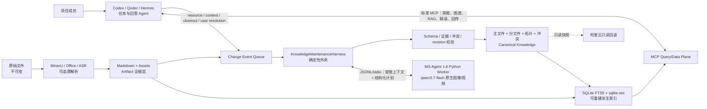

# 11 长翼久安知识系统 0.5.0 产品与技术栈基线

> 文书状态：Accepted design baseline
> 设计版本：0.5.0
> 本地构建版本：0.5.0；线上仍为 0.4.0，等待 API Key live gate 与受控发布
> 生效日期：2026-07-29
> 关联决策：[ADR-0005](adr/0005-server-maintenance-agent-harness.md)

## 0. 结论

0.5.0 不重写现有知识库，也不把团队 Agent 搬到服务器。它在现有 MinerU Document Explorer 定向 fork 上增加一个**独立、低频、受约束的知识维护 Worker**，并把当前文本检索升级为可重建的文本＋图像＋视频证据检索。

三条职责边界冻结如下：

1. **Codex、Qoder、Hermes**：理解任务、主动检索细节、核验证据、生成项目工作成果并回答用户。
2. **MCP Server**：提供项目简报、结构化记录、检索、精读、Artifact、工作回传、冲突上送和 Skill 增量同步；它不代替客户端 Agent 思考或回答。
3. **服务器维护 Worker**：只把新增资料、工作 closeout 和已确认的用户答案整理进主文件、分文件、拓扑与冲突记录；它不承接用户问答。

线上 Agent Harness 选用开源 Apache-2.0 的 **ModelScope MS-Agent 1.6** 作为原生全模态工具循环内核，默认维护模型为 **`qwen3.7-flash`**，外层仍由项目自有 `KnowledgeMaintenanceHarness` 掌握全部状态与提交权。MS-Agent 运行在隔离 Python Worker 中；Node/TypeScript 主栈、MCP、canonical repository 与查询热路径不改变。

本文是 0.5.0 的实施真相源。它仅修订旧文档中关于服务器维护 Agent、冲突闭合、多模态检索和生产拓扑的部分，不改变项目章程中的总体目标。

## 1. 第一性原理冻结

| 第一性原理 | 0.5.0 不变量 | 禁止的漂移 |
|---|---|---|
| 高度特化 | 只服务“长翼久安”科研＋社会实践项目 | 演化成通用多租户 SaaS |
| 证据优先 | 每条事实可回到 Artifact 哈希和页码、幻灯片、单元格、时间码或图像区域 | 仅凭模型总结写入正式事实 |
| 原件不可变 | 原文件只登记、版本化和归档；Markdown/frontmatter 是可维护的规范知识 | 覆盖或删除原文件 |
| 文件是真相源 | 主文件、分文件、Artifact、冲突和审计记录是 canonical；SQLite、向量与图缓存均可重建 | 引入第二套不可重建事实库 |
| 最小上下文 | 首次读取紧凑主文件；按拓扑进入分文件和 Artifact；对人名、数字、版本、原文和视觉证据主动 RAG | 每次把整库或全部文件灌给模型 |
| 持续积累 | Artifact、closeout 和项目对话中的有效信息形成增量变更包并进入维护流程 | 依赖用户反复解释项目背景 |
| 冲突诚实 | 冲突被登记、关联、检索并向本地 Agent 披露 | 服务器模型静默选边或自动修正事实 |
| Agent 全托管 | 日常摄取、整理、索引、备份和恢复无需人工值守 | 把事实冲突的语义裁决伪装成机器运维 |
| 回答在客户端 | 团队成员自己的 Agent 承担任务推理和回答 token | 用服务器维护模型替团队回答问题 |
| 单写可回滚 | 家庭节点是唯一写者；每次提交有 revision、审计和补偿回滚 | 家庭与阿里云双写或自动反向合并 |

用户回答事实冲突不是“人工运维审批”，而是系统无法替项目成员决定真实语义时的必要项目交互。除此之外，正常维护保持自动化。

## 2. 产品边界与总体架构



架构分为四个平面：

- **证据平面**：原件、MinerU 派生 Markdown、图片、表格、音视频转写和定位信息。
- **知识平面**：主文件、分文件、拓扑、结构化记录、冲突和 revision 历史。
- **查询平面**：MCP 按需组合主文件、相关分文件、细节 RAG 和 Artifact 资源，不生成最终答案。
- **维护平面**：事件触发的后台 Worker 生成结构化变更计划，确定性 Harness 校验后原子提交。

## 3. Canonical 数据结构

### 3.1 主文件

主文件在项目 Agent 首次调用 `kb_brief` 时完整返回，但必须长期保持紧凑。它只维护跨领域、频繁使用且已经确认的信息：

- 项目定位与目标；
- 产品矩阵；
- 已确认能力与成果；
- 实践地点与关键活动；
- 当前阶段、近期重点和全局风险；
- 分文件导航和全局高影响冲突。

主文件不复制分文件细节，不保存大段原文，不把计划写成成果。

### 3.2 分文件

分文件维护产品、科研、实践、对外协作、竞赛答辩等长期领域。每个分文件至少包含：

```text
overview
confirmed
planned
evidence-index
conflicts
```

新建分文件只允许在以下条件之一成立时发生：用户明确要求形成独立领域；现有职责无法容纳且至少有两个独立 Artifact；或该主题已在多个工作项中反复复用。否则更新现有分文件。

### 3.3 Artifact 与 Evidence Unit

Artifact 保存文件身份、内容哈希、版本、解析运行、规范化 Markdown、资产和来源。检索的最小证据单元统一为 `EvidenceUnit`：

```ts
type EvidenceUnit = {
  id: string;
  artifactId: string;
  artifactSha256: string;
  modality: "text" | "image" | "table" | "audio" | "video";
  locator: {
    page?: number;
    slide?: number;
    section?: string;
    bbox?: [number, number, number, number];
    sheet?: string;
    cellRange?: string;
    startMs?: number;
    endMs?: number;
  };
  excerpt?: string;
  assetUri?: string;
  contentFingerprint: string;
  confidentiality: string;
};
```

0.5 不新增原始音频 ASR 模型或服务。音频只有在授权前置流程已经提供带时间码转写时才进入文本 Evidence Unit；不得把 `qwen3.7-flash` 或 `qwen3-vl-embedding` 描述成独立音频模型。视频维护必须把受控原视频作为模型的原生 `video_url` content（优先 Base64 data URI；也可使用受审计的短时签名 URL）提交给 `qwen3.7-flash`；关键帧、OCR 和转写只是检索与定位辅助，不能替代视频原生理解或宣称等价。

### 3.4 拓扑

拓扑继续由 canonical 引用字段重建，不引入 Neo4j 或另一份图真相源：

```text
section_refs
parent_ref
child_section_refs
artifact_refs
related_refs
conflict_refs
```

SQLite 中可建立邻接缓存以加速查询，但缓存损坏不得影响 canonical 数据。

### 3.5 冲突

冲突是一等记录，至少包含相互矛盾的说法、各自证据、影响领域、严重级别、建议向用户提出的问题和状态。领域分文件保存紧凑摘要与 `conflict_ref`；全局冲突表是派生视图。

冲突状态固定为：

```text
open -> resolution_pending -> resolved
```

不存在由维护模型触发的 `auto_resolve`。文件新版本可以取代旧文件版本，但不能因此自动裁决两个事实主张。

`ConflictRecord`、开放冲突的状态、`conflict_refs` 以及主/分文件中的冲突摘要属于 **Harness 保护字段**：模型不能用通用文档补丁或拓扑补丁修改、删除、隐藏或断开。`register_conflict` 只能提出新增的 `open` 记录；`observe_conflict` 必须绑定 `target_claim_variant_refs`，只能提交“对既有冲突发现了哪些新证据”的只增不改 observation。专用 `ConflictService.append_conflict_evidence` 在 revision lock 和幂等校验后，必须验证 evidence/source 存在、同项目、内容指纹与密级有效，且只能单调追加证据/来源并更新 `last_seen_revision`，不得改写 claim 原义、状态或 resolution。若 resolved 冲突出现反驳旧 resolution 的新证据，不得静默追加后维持 resolved；必须建立一个引用旧 conflict/resolution 的新 `open` 冲突。Harness 随后从 canonical conflict 记录重新生成冲突摘要和关系，历史关系永久保留。

## 4. 技术栈继承与最小增量

### 4.1 保持不变的技术主干

| 层 | 0.4.0 基线 | 0.5.0 决定 |
|---|---|---|
| 上游 | `opendatalab/MinerU-Document-Explorer` 1.0.9 fork | 继续定向扩展，不重写 RAG 引擎 |
| 语言与运行时 | TypeScript ESM、Node.js 22；开发流程可用 Bun | 保持；生产仍用 Node 22 |
| 契约 | Zod、YAML/frontmatter、标准 MCP TypeScript SDK | 保持；新增契约继续用 Zod |
| 规范知识 | Markdown/frontmatter、版本文件、审计记录 | 保持唯一 canonical truth |
| 文本索引 | SQLite FTS5、BM25、chunking、RRF 能力已存在于上游栈 | 抽成项目检索适配器并用于家庭节点 |
| 向量索引 | `better-sqlite3` + `sqlite-vec` | 保持为可重建派生索引，不引入向量数据库服务 |
| 解析 | MinerU 云 API、Office 解析适配器 | 保持；解析结果必须带哈希、版本和定位 |
| MCP | 0.4 的 `project-read / project-maintain / project-admin`、资源 URI、Skill 增量 | 保持资源和客户端兼容；0.5 用 `project-contribute / project-resolve / project-ops` 收紧权限，legacy profile 只作迁移别名 |
| 部署 | 家庭服务器单写主节点，阿里云 HTTPS 入口与只读快照回退 | 保持，不做双写 |
| 测试 | Vitest、契约 fixture、部署 smoke test | 保持并增加 Harness/多模态/冲突测试 |

### 4.2 0.5.0 仅新增的运行依赖

| 依赖/服务 | 用途 | 边界 |
|---|---|---|
| `ms-agent==1.6.0` | 原生携带 text/image/video message、工具调用、预算与上下文压缩 | 仅隔离 Python Worker；禁用 Shell、通用网络与 MCP 回环 |
| `qwen3.7-flash` | 默认维护推理模型，原生理解文本、图片与视频并输出结构化维护计划 | 不回答团队问题，不进入查询热路径；模型 ID 可配置但必须重新验收 |
| `qwen3-vl-embedding` | 文本、图像、视频证据的共享向量空间 | 独立索引客户端，不经 Agent 框架；原视频外发仍受 Artifact 级策略控制 |
| `qwen3-vl-rerank` | 对文本/图像小候选集做可选多模态重排 | 默认由置信度门控，不是每次查询必调；0.5 不重排私有原视频 |

依赖版本在实现 Spike 通过后写入 lockfile，生产只使用锁定版本；文档不使用“latest”作为可复现版本号。

## 5. 线上 Agent Harness 选择

### 5.1 选择

采用：

```text
MS-Agent 1.6 LLMAgent（隔离 Python Worker）
        +
项目自有 KnowledgeMaintenanceHarness
```

选择原因：

- Apache-2.0 开源许可，且 1.6 明确提供多模态 Agent message 的图片/视频输入；
- 原生适配 OpenAI-compatible/DashScope 模型、工具调用、token 监控和上下文压缩；
- `qwen3.7-flash` 可直接接收视频 content，避免框架层先降格为关键帧；
- Python 只存在于独立 Worker，JSON Schema/JSONL 是唯一跨运行时边界，不侵入 Node 22 主栈；
- 它只负责短周期工具循环，不重复现有 MCP、存储、队列和审计层。

MS-Agent 的模型循环是非确定性的，因此它永远位于确定性 Harness 外围的隔离进程中。模型只“提出整理方案”，Node Harness 才决定方案是否可提交。

### 5.2 未选择的方案

| 方案 | 本轮不选原因 |
|---|---|
| LangGraph.js | 检查点能力强，但当前维护任务短周期、无模型侧写副作用；会重复现有 revision/queue 状态机 |
| OpenAI Agents JS | Guardrail 完整，但接阿里模型会多一层 adapter，运行语义更偏 OpenAI |
| Mastra / VoltAgent | 引入工作流、存储、MCP、观测等整个平台，重复已有技术栈 |
| Vercel AI SDK `ToolLoopAgent` | Node 同栈，但 Agent message 的原生视频能力不是其稳定第一公民；不满足本项目硬门槛 |
| Qwen-Agent / PydanticAI | Qwen-Agent 可作回退，但当前公开 Agent message 视频契约不如 MS-Agent 1.6 明确；PydanticAI 不作为 Qwen 原生优先方案 |
| 自写完整 Agent loop | 没必要重复工具调用协议、停止条件和 Provider 兼容工作 |

若未来维护流程演化为跨天、多级暂停恢复和复杂分支，第二候选才是 LangGraph.js。框架替换不得改变本文的数据和工具契约。

## 6. 代码边界与工具重新定义

### 6.1 目录

```text
src/project/
├── application/                  # MCP 与维护 Worker 共同复用的读取/检索服务
├── multimodal/
│   ├── alibaba-embedding-client.ts
│   ├── alibaba-rerank-client.ts
│   ├── evidence-units.ts
│   └── indexer.ts
└── maintenance/
    ├── contracts.ts
    ├── packet-builder.ts
    ├── queue.ts
    ├── prompt.ts
    ├── tools.ts
    ├── validators.ts
    ├── commit.ts
    ├── conflicts.ts
    ├── harness.ts
    └── worker.ts

src/cli/project-maintainer.ts
```

MCP adapter 和 Maintenance adapter 复用 application services；维护 Worker 不通过公网或 localhost 反向调用自己的 MCP Server。

### 6.2 框架隔离接口

```ts
interface MaintenanceAgentAdapter {
  propose(
    packet: ChangePacket,
    tools: MaintenanceReadTools,
    budget: MaintenanceBudget,
  ): Promise<MaintenancePlan>;
}
```

这个接口是框架替换边界。MS-Agent、模型供应商和 prompt 都不能渗透进 canonical repository、MCP tool 或提交事务。

### 6.3 模型可见的内部工具

这些工具使用 Zod 定义，只在 Worker 进程内注册，不通过团队公网 MCP 暴露：

| 工具 | 作用 | 副作用 |
|---|---|---|
| `read_change_packet` | 读取本次变化、base revision、预算和外发策略 | 无 |
| `read_document_blocks` | 按稳定 block key 读取主/分文件局部 | 无 |
| `read_evidence` | 按精确 locator 读取文本、表格或视觉证据 | 无 |
| `read_topology_neighborhood` | 读取受影响节点和一跳/受限二跳关系 | 无 |
| `search_maintenance_evidence` | 在本次项目、密级和预算内执行 exact/FTS/vector/multimodal 召回 | 无 |
| `find_open_conflicts` | 读取与变化主题相关的未解决冲突 | 无 |
| `submit_maintenance_plan` | 终止循环并返回符合 Schema 的计划 | 不执行写入 |
| `finish_no_change` | 明确声明没有可维护变化 | 不执行写入 |
| `report_insufficient_evidence` | 将任务送入隔离/补证分支 | 不执行写入 |

明确禁止向维护模型提供：Shell、通用文件系统、任意网络、任意 SQL、公开 MCP 回环、`update_main`、`upsert_section`、`force_accept`、`resolve_conflict` 和用户问答工具。

### 6.4 允许的 MaintenancePlan 操作

```ts
type MaintenanceOperation =
  | { op: "no_change"; reason: string }
  | { op: "patch_main"; patch: DocumentPatch }
  | { op: "patch_section"; patch: DocumentPatch }
  | { op: "create_section"; proposal: CreateSectionProposal }
  | { op: "update_topology"; patch: TopologyPatch }
  | { op: "register_conflict"; conflict: ConflictProposal }
  | { op: "observe_conflict"; observation: ConflictEvidenceObservation };
```

不存在 `resolve_conflict`。处理已经由用户确认的答案时，Worker 只能读取 Harness 锁定的 `UserConflictResolution`，再提出把该原义放入正确文档的补丁；它不能扩大、改写或重新解释用户结论。

以下内容不属于 `MaintenancePlan` 的通用可写面：existing `ConflictRecord`、冲突状态、`conflict_refs`、主/分文件的 `conflicts/global-conflicts` 派生 block。通用 `patch_main`、`patch_section` 和 `update_topology` 命中这些目标时必须 fail closed。`observe_conflict` 只是送交专用 `ConflictService` 的受约束 observation，不直接写记录。冲突状态只能由三笔命名事务改变：`register_open_conflict` 新建 open；`lock_user_resolution` 原子写入用户 resolution record、执行 `open -> resolution_pending` 并入队 ChangePacket；`apply_typed_resolution` 将 typed outcome 与文档/拓扑补丁同事务提交，执行 `resolution_pending -> resolved` 或 `resolution_pending -> open`。补证事务不得改变状态。

文档补丁必须包含目标 revision、稳定 block key、旧 block 哈希、证据引用和原因。模型不得自由删除 block；旧版本和冲突历史持续保留。

### 6.5 0.5 MCP capability 矩阵

| Profile | 暴露位置 | 能力 | 明确没有的能力 |
|---|---|---|---|
| `project-read` | 团队 HTTPS / 阿里只读回退 | Skill、简报、图谱、检索、精读、视图 | 工作写回、摄取、冲突解决、canonical patch |
| `project-contribute` | 团队 HTTPS 默认 | read ＋ work、resource、context、closeout | canonical patch、摄取运维、冲突解决 |
| `project-resolve` | 带独立 capability 的团队身份 | contribute ＋ `kb_submit_user_resolution` | 代用户选边、直接改冲突或文档 |
| `project-ops` | 家庭 loopback/受限 service principal | read ＋ bootstrap、ingest、parse、health/rebuild | canonical patch、语义冲突解决、团队公网默认访问 |
| internal Worker | 不走 MCP | application services ＋受限模型只读工具＋Harness commit | 任何公开 MCP profile |

0.5 发布时，`project-maintain` 仅可作为 `project-contribute` 的兼容别名，`project-admin` 仅可作为家庭 loopback 的 `project-ops` 兼容别名且不得继续作为团队公网 principal。为承接已加载 0.4 Skill 的在途任务，旧工具名保留一个完整 Skill 发布窗口，但语义必须改为 proposal-only shim：只生成 ChangePacket，返回 `migration_required`、packet ID、当前 revision 和弃用信息，不直接写 canonical 或改变冲突/memory 状态。新 Skill 从下一任务或客户端重启生效；阿里回退始终只有 `project-read`。

机器可读目标契约见 [specs/mcp-surface.v0.5.yaml](specs/mcp-surface.v0.5.yaml)。0.4 历史 spec 不改写；目标 spec 与实际工具面、Skill 和镜像一致前，运行版本保持 0.4.0。

## 7. 增量维护工作流

### 7.1 触发事件

- Artifact 首次解析完成或内容哈希变化；
- 客户端发布新资源；
- `kb_capture_context` 或 `kb_finish_work` 形成新的项目信息候选；
- 用户提交冲突答案；
- 证据被标记 stale；
- 周期性领域校准到期。

机械步骤先完成哈希、去重、解析、Evidence Unit 构建、向量化和路由。只有确定存在语义变化时才调用维护模型。

### 7.2 ChangePacket

每次模型调用只接收：

- 触发事件和幂等键；
- 当前 knowledge/topology/document revisions；
- 变化 Artifact 与精确证据；
- 候选分文件、拓扑邻居和相关未解决冲突；
- token、工具次数、分文件和多模态资产预算；
- 允许外发的最高密级和模型供应商。

它不包含全库正文、全部向量或无关原文件。需要下钻时只能使用第 6.3 节的受限只读工具。

0.5.0 默认预算作为 `maintenance-budget/v1` 随 Harness 版本化：`max_tool_calls=8`、整个循环累计计费输入 `max_cumulative_input_tokens=12000`、单步上下文 `max_context_tokens_per_step=6000`、累计输出 `max_cumulative_output_tokens=3000`、`max_sections=6`、`max_evidence_units=40`、`max_multimodal_assets=12`，正常生成 1 次且最多允许 1 次受限 Schema 修复。Harness 必须累加供应商逐步 usage，而不是把 12000 当成每一步的额度。单 packet 费用上限由部署配置给出并写入审计，未配置或预计越界时 fail closed；事件默认合并 60–120 秒。确定性 lint 每次提交都执行，语义校准默认每 7 天或累计 20 个 revision 按单领域触发，无漂移信号直接 `no_change`，不得借校准全库重写。

### 7.3 状态机

```text
queued
  -> leased
  -> context_ready
  -> proposed
  -> validating
  -> committing
  -> committed | no_change
```

失败分支：暂时性模型/网络错误进入有预算重试；revision 过期则废弃 packet 并重建；Schema 或证据失败只允许一次受限修复，仍失败则隔离；重试耗尽进入 dead letter。每个项目只有一个写租约。

### 7.4 确定性提交门禁

Harness 必须逐项验证：

- Zod Schema、操作白名单和工具调用预算；
- 每个事实 block 的证据存在且指纹匹配；
- 计划、获批、执行中和已形成成果没有混写；
- open conflict 没有被写成单一确定事实；
- existing conflict 记录、状态、引用和派生摘要没有被通用计划修改、删除或隐藏；开放冲突引用只能增加，不能被模型 unlink；
- 用户冲突答案仅被原义传播；
- 主文件只修改允许的稳定领域；
- 拓扑无悬空引用、父子循环和重复 section key；
- 密级不降低，Markdown 中的指令不被当成系统指令；
- 所有 expected revision 仍匹配；
- 密钥、令牌和原始聊天全文没有进入知识文件。

通过后不能假设“多个 Markdown 文件可一起原子 rename”。提交协议固定为：

1. 在 `knowledge/staging/<commit-id>/` 构建完整候选；
2. 生成不可变 `knowledge/revisions/<knowledge-revision>/`，包含主文件、分文件、冲突、拓扑和状态固定为 `published` 的 RevisionManifest；另行生成不可变 `knowledge/indexes/<index-revision>/` 派生索引；
3. 全量校验并 fsync canonical revision、index revision 的文件与目录；RevisionManifest 绑定 `knowledge_revision`、`topology_revision` 与 `index_revision`。`manifest_hash` 固定为 `sha256(JCS(manifest excluding manifest_hash))`：按 RFC 8785 JSON Canonicalization Scheme 序列化移除该字段后的对象，取 UTF-8 bytes 的小写十六进制 SHA-256。manifest 发布后永不改状态；是否 current/superseded 由 pointer 与 append-only lifecycle event 派生；
4. 写入并 fsync 临时 `current-revision.json`，其 Schema 固定绑定 `{knowledge_revision, topology_revision, index_revision, manifest_hash}`，再用单文件 rename 原子替换 current pointer，并 fsync 父目录；
5. 查询请求读取 pointer 一次并固定一个 `KnowledgeSnapshot` 到请求结束；pointer 未切换的 staging 永远不可见；
6. 进程恢复只从 current pointer 重建 snapshot，孤儿 staging/revision 进入回收审计；
7. 回滚发布新的补偿 revision，不把 pointer 静默拨回旧历史，也不重写旧 revision。

只有单个 current pointer 的替换承担发布原子性，避免主文件、分文件、拓扑和索引出现半 revision。

## 8. 冲突上送与用户解决协议

查询返回相关事实时，MCP 必须按领域、实体、Artifact 和证据关系附加开放冲突。`kb_brief` 只携带全局高影响冲突；细节冲突随 `kb_graph_context`、`kb_search` 或 `kb_read` 的命中返回，避免每次污染上下文。

本地 Agent 收到冲突后应：

1. 对当前任务谨慎回答，明确说明存在的版本或说法差异；
2. 在确实影响任务时向用户提出冲突记录中的紧凑问题；
3. 用户明确回答后，通过目标 0.5 工具 `kb_submit_user_resolution` 提交原话哈希、来源任务、期望 conflict revision 和幂等键；共享 token 时服务只记录 `client_attested/team-principal`，不得把哈希当成人类作者证明；
4. MCP application service 执行 `lock_user_resolution`：原子保存锁定答案、执行 `open -> resolution_pending` 并入队 ChangePacket；任一步失败均保持 `open`；
5. 维护 Worker 只负责生成原义文档补丁和 typed resolution proposal；专用 ConflictService 执行 `apply_typed_resolution`，与文档/拓扑补丁同事务提交后才变为 `resolved`，若 typed outcome 是 `remain_open` 则回到 `open`；
6. 原冲突、旧说法、证据与展示事件永久保留。

用户答案不必“选择其中一方”。typed resolution outcome 至少支持：某一说法被取代；双方因时间/地域/对象不同而缩小作用域后同时成立；双方均被否定并形成新结论；某条候选被拒绝；或答案仍不足、冲突继续 `open`。Harness 不得把任意用户答案强制映射为 `superseded`。

如果用户没有回答，冲突长期保持 `open`，系统仍可继续其他工作，不得反复阻塞无关任务。

## 9. 多模态检索与低 token 返回

### 9.1 索引

0.5.0 采用：

```text
结构化过滤
  + SQLite FTS5 / BM25
  + qwen3-vl-embedding 1024 维向量召回
  + RRF/项目权重融合
  + 低置信度时可选 qwen3-vl-rerank
```

1024 维是初始平衡点，不是永久常量；任何维度调整都必须建立新索引版本并完成离线评测，不能原地混写不同维度。

每个图像或视频派生 Evidence Unit 都保留对应 Artifact、页码/幻灯片/时间码、bbox、caption/OCR 和 `kb://` 资源 URI。0.5 的资源读取目标是返回真实图片/关键帧资源或可安全取得的受控二进制，而不是当前仅返回 YAML 元数据。

维护推理与检索索引是两条路径：维护 Worker 必须把原视频作为 `qwen3.7-flash` 的原生视频 content；索引仍可同时保存视频向量、关键帧图像向量和转写文本向量，用于低成本召回与精确时间码定位。受保护视频优先使用 Base64 data URI；超出传输预算时才生成带 Artifact 哈希、最短 TTL 和删除审计的签名 URL。任何只处理关键帧的运行都必须标记 `native_video_understood=false`。

### 9.2 查询路径

1. 新任务先同步 Skill 版本并读取紧凑主文件；
2. 用结构化字段和 FTS 处理确定性问题；
3. 用文本查询同时召回文字、页面图像、表格、视频向量、关键帧和已有时间码转写；
4. 沿主文件→分文件→Artifact 拓扑展开；
5. 对人名、数字、版本、原文、图表与成果状态主动精读；
6. 返回证据包、定位和资源，不在服务器生成最终答案。

默认不对每次查询调用多模态重排。只有候选相近、跨模态或置信度不足时，由策略或客户端显式请求重排，以控制家庭服务器延迟和项目方 API 成本。

## 10. 生产部署

### 10.1 家庭主节点

家庭服务器继续是唯一写者，拆成两个相互隔离的进程/容器：

- **MCP Query Service**：处理团队请求、只读查询和 work/resource/context/closeout 等受控贡献；不提供直接 canonical patch，也不运行维护模型；
- **Maintenance Worker**：消费本地持久队列，调用阿里模型，生成计划并提交 canonical revision。

队列沿用本项目文件＋SQLite 技术栈实现持久 event、lease、retry 和 idempotency，不引入 Redis、Kafka 或外部工作流数据库。Worker 使用独立 CPU、内存、并发和费用预算。它的故障不得拖慢或重启 MCP 查询服务；队列积压只影响知识更新时效，不影响已提交快照的读取。

### 10.2 阿里云

`https://argonai.cn/cyj/mcp` 继续作为团队唯一入口。阿里云负责 TLS、认证、主链路代理和家庭节点不可达时的 `project-read` 快照回退。回退节点：

- 不运行维护 Worker；
- 不接受 Artifact 摄取、知识写入或冲突解决；
- 不向家庭节点反向合并；
- 家庭节点恢复并通过一致性检查后，新会话再切回主节点。

### 10.3 云外发

用户已授权把本项目允许范围内的资料发送到 MinerU 云 API 和阿里百炼模型 API。该授权不等于密钥可入库，也不等于未来任意敏感文件默认外发。每次作业仍记录供应商、模型、资料分类、输入哈希、用途和费用；API Key 只从受管环境变量注入。

0.5 的百炼配置目标冻结为华北 2（北京）业务空间专属 endpoint，因为 `qwen3-vl-embedding` 的当前官方可用模型表列于北京地域。配置必须把 `provider_region=cn-beijing`、业务空间 endpoint、API dialect、模型 ID 和 key reference 作为同一版本化 tuple；Key 与 endpoint 不得跨地域混用。实际部署前必须确认现有百炼 Workspace/API Key 是否属于北京地域，若不是则需要用户选择新建北京 Workspace 或更换模型方案。

## 11. 版本、Skill 与发布纪律

0.5.0 必须分别版本化：

- 产品/协议版本；
- MCP Server 版本；
- Skill bundle 版本和每文件 SHA-256；
- Harness、tool schema 和 prompt 版本；
- 模型 ID、provider region、workspace endpoint、API dialect、embedding 维度与 index version；
- knowledge revision 和 topology revision。

本文件落地不代表服务器已升级。实现完成前，运行时、镜像和 Skill 仍保持 0.4.0。只有在代码、迁移、回归、故障注入、家庭主节点和阿里回退全部验收后，才能把 0.5.0 Server 与 Skill 的同版本产物一次性生成并发布；各分布式客户端通过版本握手、下一任务/重启激活和 legacy shim 分阶段切换，不假设所有客户端瞬时原子升级。generated bundle 只能通过现有同步脚本生成，不能手改。

## 12. 分阶段落地

1. **契约与实现债务**：新增 ChangePacket、MaintenancePlan、ConflictRecord、UserConflictResolution；把当前自动冲突取代改为只登记；标记 0.4 `project-maintain` 直接写主/分文件为迁移期能力。
2. **检索索引**：把已有 FTS5、chunking、RRF 和 sqlite-vec 能力接入项目 runtime；建立 Evidence Unit 和增量索引版本。
3. **多模态 Spike**：在北京业务空间验证 `qwen3-vl-embedding` 1024 维、图文/表格/视频的跨模态召回、图片/视频资源回传、时间码 locator 和受控 rerank；原始音频仍不在强制范围。
4. **Harness Spike**：验证 `qwen3.7-flash` 在 MS-Agent 1.6 中的图片与原生视频输入、JSON Schema tool calling、超时、最大 8 步和幂等重试，并证明只给关键帧的负例不会被标成原生视频理解。
5. **维护 Worker**：实现持久队列、租约、ChangePacket、只读工具、计划校验、原子提交和 revision manifest。
6. **MCP/Skill 迁移**：实现 `specs/mcp-surface.v0.5.yaml`；团队默认入口从公开 `project-admin` 切到 `project-contribute`，解决 capability 独立分配；legacy 写工具先改为 proposal-only shim，待一个完整 Skill 窗口无调用后移除，canonical commit 始终收口到 Worker。
7. **部署验收**：家庭双进程隔离、阿里只读回退、断网积压恢复、旧客户端兼容和一键回滚。

## 13. 0.5.0 验收门槛

- 维护模型无法调用 Shell、网络、公开 MCP 或任何直接 canonical 写工具；
- legacy `kb_update_main/kb_upsert_section/kb_reconcile_memory` 即使在兼容窗口仍只能生成 proposal，绝无直接 canonical/policy 写语义；`project-admin/project-ops` 不经默认公网入口暴露；
- 重复 ChangePacket 不产生重复知识或 revision；
- 并发 revision 变化时不发生部分写入；
- open conflict 在 100% 相关检索中被附加，且维护模型无法关闭；同一冲突的后续补证只能单调追加且不改变 claim 原义、状态或 resolution；
- 通用文档/拓扑补丁无法删除、改写或断开开放冲突，解决后的历史引用仍保留；
- 只有带预期 revision 的用户答案可进入 `resolution_pending`；
- typed resolution 可表达单方取代、双方分域有效、双方否定、拒绝或继续开放，不强迫选边；
- 主文件、分文件、拓扑和索引可从文件重建；
- 文搜图、文搜表格、文搜视频关键片段的真实项目评测达到预设 Recall@K；
- 所有返回包含 Artifact 与精确 locator；
- 查询热路径不调用维护推理模型；
- Maintenance Worker 故障时 MCP 仍能读取上一致快照；
- 家庭节点不可达时阿里只读回退不出现写工具；
- Server、Skill、tool schema、prompt 和 index 版本可被审计并支持补偿回滚；同版本发布产物一致，客户端分阶段激活可由握手与 shim 兼容；
- 文本、图像、表格、原生视频、视频关键帧和跨模态 gold 分桶分别达到 [08-acceptance-evaluation.md](08-acceptance-evaluation.md) 的 Recall/locator 门槛；
- canonical 发布只通过 immutable revision＋单 current pointer，故障注入中半 revision 可见数为 0；
- 百炼 region、workspace endpoint、API key 和模型 ID 匹配，视频原生输入与外发审计通过，原始音频没有未经新增授权外发。

## 14. 已冻结权限与最后配置门禁

冲突权限已经冻结：仅项目负责人和配置中的指定负责人持有独立 `project-resolve` token/principal。共享团队 token 只拥有 `project-contribute`。未授权成员的 Agent 必须披露冲突，可以按当轮用户回复调整当前答案，但该回复不得进入任何 MCP 持久写路径。

第二项是百炼地域：请确认现有 Workspace/API Key 是否属于 **华北 2（北京，`cn-beijing`）**。如果不是，需要在“新建北京 Workspace”与“更换兼容模型方案”之间由用户决定；Key、endpoint 和模型列表不能跨地域拼接。

API Key 是最后一个 live gate：代码、mock、离线契约、故障注入、镜像和 Skill 先完成；Key 到位后只执行北京 region/endpoint/model tuple、tool calling、图片、原生视频和 embedding 的真实调用验收。原始音频理解仍需另行选择 Omni/ASR 模型。

## 15. 官方技术依据

- [ModelScope MS-Agent repository](https://github.com/modelscope/ms-agent)
- [MS-Agent 1.6.0 release](https://github.com/modelscope/ms-agent/releases/tag/v1.6.0)
- [MS-Agent multimodal support](https://github.com/modelscope/ms-agent/blob/main/docs/zh/Components/multimodal-support.md)
- [阿里百炼视觉模型与 qwen3.7-flash](https://help.aliyun.com/en/model-studio/vision-model/)
- [阿里百炼 OpenAI-compatible 图像/视频消息](https://help.aliyun.com/en/model-studio/qwen-api-via-openai-chat-completions)
- [阿里百炼多模态 Embedding API](https://help.aliyun.com/zh/model-studio/multimodal-embedding-api-reference)
- [阿里百炼向量与重排序模型选择](https://help.aliyun.com/zh/model-studio/embedding-rerank-model)
- [阿里百炼多模态 Rerank API](https://help.aliyun.com/zh/model-studio/text-rerank-api)
- [阿里百炼 OpenAI 兼容调用说明](https://help.aliyun.com/en/model-studio/first-api-call-to-qwen)
- [阿里百炼地域与业务空间 endpoint](https://help.aliyun.com/zh/model-studio/regions/)
