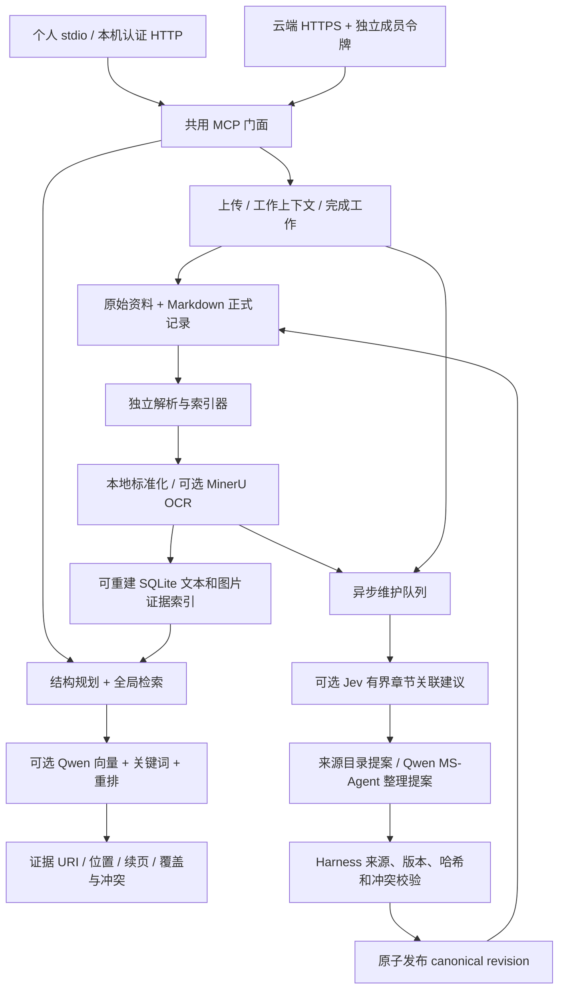

# 可部署的结构化知识与多模态 RAG 架构

同一份内核可以服务个人电脑或共享服务器。部署模式只决定进程生命周期、网络入口、身份和权限；资料格式、检索、证据与维护协议保持一致。

## 知识与索引

主文件和 `knowledge_section` 分文件提供完整的项目方向和主题层次；引用关系连接真实 artifact。正式知识保存在带 frontmatter 的 Markdown revision 中。原始文件、normalized 正文和图片保留稳定 ID、字节哈希及解析收据。派生 SQLite 索引不拥有独立事实，可以从 canonical 数据重建。

一次查询先按项目、保密等级和记录状态界定可见范围，从实际主文件和分文件规划来源；同时在整个可见项目语料中做全局召回。文本检索融合中文 bigram/BM25、启用的 Qwen embedding、结构加权及 rerank；图片用实际像素 embedding、图文查询和视觉重排。来源多样性只在相近得分中轮换，副本延后但不丢失来源。未关联到文件树的材料仍可通过全局索引召回。

`kb_search` 返回来源 ID、证据 URI、位置、版本、解析/向量覆盖缺口和相关冲突。`intent=collect` 通过与查询条件和语料版本绑定的 cursor 继续召回。`kb_read` 支持原图及版本绑定的文本续读。计划来源未命中时可以用 `source_ids` 定向补查，或直接读取来源。没有登记的文件、无法解析的内容和权限外数据不在完备性承诺内；索引翻完不等于所有事实均被找到。

未启用 Qwen 时，机制明确回退到结构和词法检索，照片仍可通过元数据查询并读像素，视觉语义匹配不会被伪造。扫描 PDF 未启用 OCR 时也保留相应缺口。

## 两种部署方式

个人实例默认 stdio：客户端管理服务进程，不开放端口；多个本机客户端共用同一私有目录。需要 HTTP 时默认认证 loopback。registry 只有单一 owner，拒绝新增协作成员。Docker 个人配置只发布 `127.0.0.1:8793`。本地文件系统访问者就是部署者；主机上的其他账户由系统目录权限隔离。

协作实例采用标准 Streamable HTTP，经部署者自己的 HTTPS 入口访问。成员拥有独立令牌，服务端只保存摘要；读、贡献、裁决和运维能力分别注册，普通成员没有 direct main/section 写入工具。每次请求重新读取原子 registry，撤权立即拒绝旧请求，角色变化拒绝保留旧能力的会话。身份不由工具参数或客户端名字决定。

单个部署对应一个共享项目。不同团队使用不同卷与 registry；此版本没有承诺同一进程内的多租户项目隔离。查询/索引/维护可以独立运行，但同一 canonical 根只配置一个常驻维护服务。SQLite 租约和 canonical revision 校验避免重复消费及过期覆盖。外部模型等待发生在维护进程，查询无需等它结束。

## Jev 与维护

Jev 位于解析之后、提案之前，只建议证据与章节的关联。`off` 不构造外发请求；`shadow` 保存意见而不改候选；`advisory` 仅补充合格候选，不删除原来的结构候选。每次最多八份合格来源、每份最多四段 300 字摘要，章节和问题预算有限；超时、模型响应异常、源哈希或 revision 变化都会回退。Jev 不进入用户查询，也不写 canonical。

无外部模型的 `catalog` 模式只为新解析来源创建导航分文件，通过同一 Harness 提交；不会从原文推理事实。Qwen/MS-Agent 模式可提出正文块变更、章节和关系更新。Harness 检查项目、证据状态、包范围、原文哈希、预期 canonical revision、完整 mutable block 及冲突规则，然后原子发布。拒绝的提案保持隔离；任务完成、资料发表或入队均不等于 canonical 已更新。

争议知识不会凭模型信心晋升。只有 owner/designated resolver 凭明确用户指令提交锁定裁决，后台才能处理相应冲突。Qwen 整理无法绕过这一入口。模型返回的缺失字段、来源 ID 或哈希不会被人为补成通过校验的值。

## 配置、更新和发布边界

`knowledge.config.json` 描述模式、实例 UUID、项目 ID、数据目录和 provider 开关。私有 `secrets.env` 只注入允许的 key/模型设置。关闭 provider 时删除继承的环境密钥，并禁用无关 qmd 用户配置中的 MinerU 自动凭据，以防显式关闭仍触发外发。

每个部署生成自己的 Skill release，包括实例配置、实际文件 SHA-256 和独立名称。`kb_sync_skill` 提供相同的文本/结构化增量，客户端在已确认的本地目录内验证、更新、复验。智能体不依赖 OpenAI 插件；不能安装 Skill 时继续按实时工具和控制信息工作。

一次性介绍使用独立 campaign，按电脑上的 OS 标识进行实例范围哈希；不能获得 OS 标识时用持久用户目录 ID。原始硬件 ID 不上传，不以 Token/IP/session 去重。服务端先原子登记一次性投递收据再回包，宁可丢失一次响应也不自动重说；客户端 marker 位于 Skill 目录之外，跨客户端和升级持久保留。无持久本地状态时静默跳过。

`scripts/export-knowledge-engine.mjs` 按静态模块依赖闭包和资产白名单导出独立包。源码事实内核直接复用，只有原部署的 generated Skill adapter 被替换为独立部署适配器。包只含代码、通用配置、文档、许可证和合成验收；不导出真实资料、服务器环境、令牌、邀请、用户数据库、学校后端或原始工作报告。`release-manifest.json` 记录源文件哈希和这项转换，便于检查同步范围。
